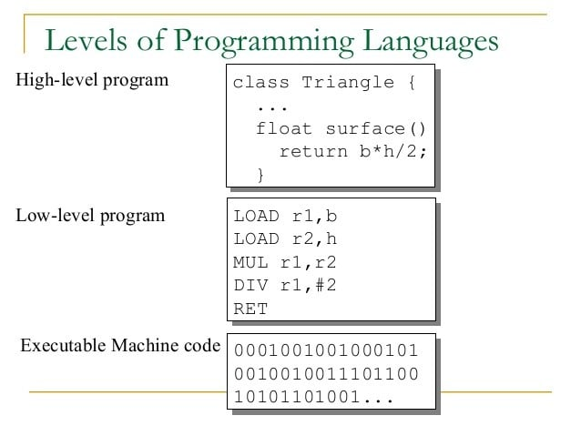

# Day 1 — Foundations & Variables
## C Programming Fundamentals Course

[](https://en.wikipedia.org/wiki/C_(programming_language))
[](https://github.com)
[](https://github.com)

> **A comprehensive introduction to C programming covering variables, data types, and fundamental concepts.**

---

## 📋 Table of Contents

- [Overview](#overview)
- [Learning Objectives](#learning-objectives)
- [Prerequisites](#prerequisites)
- [Setup Instructions](#setup-instructions)
- [Course Content](#course-content)
- [Code Examples](#code-examples)
- [Practice Exercises](#practice-exercises)
- [Quiz](#quiz)
- [Resources](#resources)
- [Troubleshooting](#troubleshooting)

---

## 🎯 Overview

This is the first day of a structured C programming course designed for absolute beginners. In this 90-minute session, you'll learn the foundational concepts of programming and write your first C programs.

**What You'll Build:**
- Hello World program
- Variable manipulation programs
- Constants demonstration
- Conditional logic implementation

---

## 🎓 Learning Objectives

By the end of this session, you will be able to:

- ✅ Explain what a program is and the role of compilers
- ✅ Write simple pseudocode and draw basic flowcharts
- ✅ Declare and initialize variables in C with appropriate data types
- ✅ Use proper variable naming conventions
- ✅ Compile and run C programs using GCC
- ✅ Apply format specifiers correctly for input/output operations

---

## 📚 Prerequisites

- Basic computer literacy
- Ability to use a text editor
- Familiarity with command line/terminal
- No prior programming experience required!

---

## 🛠️ Setup Instructions

### Step 1: Install GCC Compiler

**Windows:**
```bash
# Install MinGW or use TDM-GCC
# Download from: https://jmeubank.github.io/tdm-gcc/
```

**macOS:**
```bash
# Install Xcode Command Line Tools
xcode-select --install
```

**Linux:**
```bash
sudo apt-get update
sudo apt-get install build-essential
```

### Step 2: Verify Installation

```bash
gcc --version
```

### Step 3: Choose Your Editor

Recommended options:
- **VS Code** (with C/C++ extension)
- **Dev-C++**
- **Code::Blocks**
- **Vim/Nano** (for terminal enthusiasts)

### Step 4: Create Working Directory

```bash
mkdir c-programming-day1
cd c-programming-day1
```

---

## 📖 Course Content

### 1. What is a Program?

A **program** is a sequence of instructions that tells a computer what to do. **Programming** is the process of writing these instructions.

**Example Flow:**
```
1. Get length from user
2. Get width from user
3. Multiply length by width
4. Display the result
```

---

### 2. Programming Languages & Compilers

**High-Level vs Low-Level Languages:**

| Aspect | High-Level (C, Python) | Low-Level (Assembly) |
|--------|----------------------|---------------------|
| Readability | Easy to understand | Difficult to read |
| Abstraction | High | Low |
| Hardware Control | Limited | Direct |
| Development Speed | Fast | Slow |

**Visual Reference:**



*Learn more: [High vs Low Level Languages](https://www.educba.com/high-level-languages-vs-low-level-languages)*

**Compilation Process:**
```
┌─────────────┐     ┌──────────┐     ┌────────────┐     ┌─────────┐
│ hello.c     │ --> │   GCC    │ --> │  hello.exe │ --> │ Output  │
│ (C code)    │     │(Compiler)│     │(Executable)│     │         │
└─────────────┘     └──────────┘     └────────────┘     └─────────┘
```

---

### 3. Algorithm

**Definition:** A step-by-step procedure to solve a problem.

**Characteristics:**
- ✓ **Finite** - Must end after limited steps
- ✓ **Definite** - Each step is clear
- ✓ **Input** - Zero or more inputs
- ✓ **Output** - At least one output
- ✓ **Effective** - Steps can be executed

**Example Algorithm:**
```
Algorithm: Find Larger of Two Numbers
Step 1: Start
Step 2: Input num1, num2
Step 3: If num1 > num2 then
            Display "num1 is greater"
        Else
            Display "num2 is greater"
Step 4: Stop
```

---

### 4. Pseudocode

**Plain-language description of program logic**

```
BEGIN
  INPUT num1
  INPUT num2
  IF num1 > num2 THEN
    SET max = num1
  ELSE
    SET max = num2
  END IF
  OUTPUT max
END
```

---

### 5. Flowcharts

**Visual representation using standardized symbols**


*Learn more: [Flowchart Symbols Guide](https://www.smartdraw.com/flowchart/flowchart-symbols.htm)*

**Example - Check Even or Odd:**
```
        (START)
           |
           v
    [ INPUT number ]
           |
           v
    < number % 2 == 0 ? >
       /          \
     YES           NO
      |             |
      v             v
[OUTPUT "Even"] [OUTPUT "Odd"]
      |             |
       \           /
        v         v
         (END)
```

---

### 6. C Syntax Basics

**Statements:**
```c
int x = 5;           // Declaration statement
printf("Hello");     // Function call statement
```

**Blocks:**
```c
{
    int a = 10;
    printf("%d", a);
}
```

**⚠️ Common Syntax Errors:**
- ❌ Missing semicolons
- ❌ Mismatched braces `{ }`
- ❌ Case sensitivity: `Printf` vs `printf`
- ❌ Using `=` instead of `==` in conditions

---

### 7. Variables

**Definition:** Named location in memory that stores a value.

**Memory Metaphor:** 
```
┌─────────────┐
│   age = 21  │  ← Variable (labeled box)
└─────────────┘
```

**Variable Lifecycle:**
1. **Declaration** → Creating the variable
2. **Initialization** → Giving initial value
3. **Usage** → Reading/modifying value

---

### 8. Variable Naming Rules

**✅ Valid Names:**
- `age`
- `student_count`
- `_temp`
- `totalMarks`

**❌ Invalid Names:**
- `2ndPlace` (starts with digit)
- `student-name` (contains hyphen)
- `int` (reserved keyword)
- `my age` (contains space)

**Best Practices:**
```c
// Good
int total_marks = 85;
float average_score = 78.5;

// Avoid
int tm = 85;
float x = 78.5;
```

---

### 9. Data Types in C

| Type | Size | Range | Format | Example |
|------|------|-------|--------|---------|
| `int` | 4 bytes | -2,147,483,648 to 2,147,483,647 | `%d` | `int age = 21;` |
| `char` | 1 byte | -128 to 127 (or 0 to 255) | `%c` | `char grade = 'A';` |
| `float` | 4 bytes | ~6-7 decimal precision | `%f` | `float price = 19.99;` |
| `double` | 8 bytes | ~15-16 decimal precision | `%lf` | `double pi = 3.14159265359;` |

---

### 10. Variable Declaration & Constants

**Declaration & Initialization:**
```c
// Declaration only
int age;
int x, y;

// Declaration with initialization
int age = 21;
int x = 5, y = 10;
```

**Constants:**
```c
const double PI = 3.14159;
const int MAX_STUDENTS = 50;

// PI = 3.14;  // ❌ ERROR: cannot modify constant
```

**Why use `&` with scanf?**
```c
int num;
scanf("%d", &num);  // & provides memory address
```

📝 `scanf()` needs the memory address to store input. Arrays don't need `&` because array names are already addresses.

---

## 💻 Code Examples

### Example 1: Hello World

**File:** `hello.c`

```c
#include <stdio.h>

int main() {
    printf("Hello, World!\n");
    return 0;
}
```

**Compile & Run:**
```bash
gcc hello.c -o hello
./hello
```

**Expected Output:**
```
Hello, World!
```

---

### Example 2: Variables and Format Specifiers

**File:** `variables.c`

```c
#include <stdio.h>

int main() {
    int age;
    float height;
    char grade;
    
    printf("Enter your age: ");
    scanf("%d", &age);
    
    printf("Enter your height (in meters): ");
    scanf("%f", &height);
    
    printf("Enter your grade: ");
    scanf(" %c", &grade);  // Space before %c to skip whitespace
    
    printf("\n--- Your Information ---\n");
    printf("Age: %d years\n", age);
    printf("Height: %.2f meters\n", height);
    printf("Grade: %c\n", grade);
    
    return 0;
}
```

**Test Input:**
```
Enter your age: 21
Enter your height (in meters): 1.75
Enter your grade: A
```

---

### Example 3: Using Constants

**File:** `constants.c`

```c
#include <stdio.h>

int main() {
    const double PI = 3.14159;
    const float TAX_RATE = 0.15;
    
    float radius;
    double area;
    
    printf("Enter circle radius: ");
    scanf("%f", &radius);
    
    area = PI * radius * radius;
    printf("Circle area: %.2f\n", area);
    
    float price, final_price;
    printf("Enter product price: ");
    scanf("%f", &price);
    
    final_price = price + (price * TAX_RATE);
    printf("Price after tax: %.2f\n", final_price);
    
    return 0;
}
```

---

### Example 4: Find Larger Number

**File:** `larger.c`

```c
#include <stdio.h>

int main() {
    int num1, num2, larger;
    
    printf("Enter first number: ");
    scanf("%d", &num1);
    
    printf("Enter second number: ");
    scanf("%d", &num2);
    
    if (num1 > num2) {
        larger = num1;
    } else {
        larger = num2;
    }
    
    printf("The larger number is: %d\n", larger);
    
    return 0;
}
```

**Test Cases:**
```
Test 1: 15, 28 → Output: 28
Test 2: -5, 3 → Output: 3
Test 3: 10, 10 → Output: 10
```

---

## 🏋️ Practice Exercises

### Exercise 1: Temperature Converter
Write a program that converts Celsius to Fahrenheit.
- Formula: `F = (C × 9/5) + 32`

### Exercise 2: Simple Calculator
Create a program that:
1. Takes two numbers as input
2. Displays their sum, difference, product, and quotient

### Exercise 3: Age Calculator
Write a program that:
1. Takes birth year as input
2. Calculates and displays current age

### Exercise 4: Rectangle Properties
Create a program that calculates both area and perimeter of a rectangle.

---

## 📝 Quiz

**Question 1:** What does a compiler do?  
a) Executes code line by line  
b) Translates entire source code to machine code 
c) Debugs your program  
d) Writes code for you

**Question 2:** Which is a valid variable name in C?  
a) 2ndPlace  
b) student-name  
c) _total_marks   
d) int

**Question 3:** What is the correct format specifier for printing an integer?  
a) %f  
b) %c  
c) %d   
d) %s

**Question 4:** Why do we use & with scanf for int variables?  
a) It's optional  
b) To pass the variable's address
c) To make it faster  
d) To initialize the variable

**Question 5:** What is the size of an int on most modern systems?  
a) 1 byte  
b) 2 bytes  
c) 4 bytes 
d) 8 bytes

**Question 6:** Which symbol represents a decision in a flowchart?  
a) Rectangle  
b) Oval  
c) Diamond  
d) Parallelogram

**Question 7:** What happens if you use an uninitialized variable?  
a) Program won't compile  
b) Variable has value 0  
c) Variable has garbage value 
d) Program crashes

---

## 📚 Resources

### Books
- **"The C Programming Language"** by Kernighan & Ritchie (K&R) - The definitive C bible
- **"C Programming: A Modern Approach"** by K.N. King - Comprehensive modern guide

### Online Resources
- [GeeksforGeeks C Programming](https://www.geeksforgeeks.org/c-programming-language/) - Comprehensive tutorials
- [Learn-C.org](https://www.learn-c.org/) - Interactive C tutorial
- [GCC Documentation](https://gcc.gnu.org/onlinedocs/) - Official compiler reference
- [C Reference](https://en.cppreference.com/w/c) - Complete language reference

### Video Tutorials
- [CS50 by Harvard](https://cs50.harvard.edu/) - Excellent beginner course
- [freeCodeCamp C Tutorial](https://www.youtube.com/watch?v=KJgsSFOSQv0) - Comprehensive video course

---

## 🤝 Contributing

Found an error or want to improve this course? Feel free to:
1. Fork the repository
2. Create your feature branch
3. Commit your changes
4. Push to the branch
5. Open a Pull Request

---

## 👨‍💻 Author

Created with ❤️ By **Okasha Nadeem** for aspiring C programmers

---

**Happy Coding! 🚀**